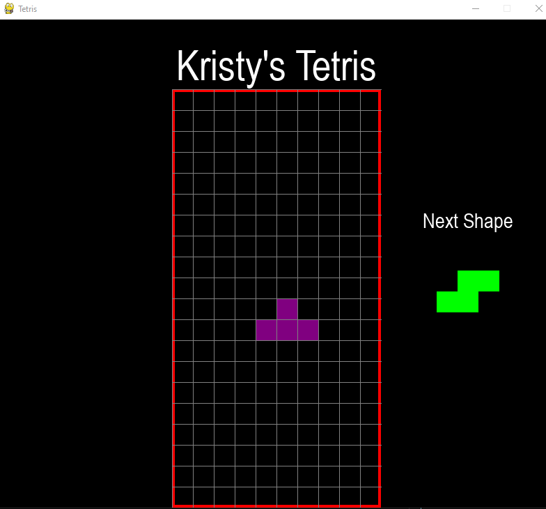

<!-- #  -->

# Personal Project: Tetris 

<i>⏳ In Progress: Developing via tutorial</i>

---

## About:

- Building & customisation of Tetris using the [FreeCodeCamp](https://www.freecodecamp.org/) tutorial [here](https://www.youtube.com/watch?v=XGf2GcyHPhc) & [here](https://www.youtube.com/watch?v=zfvxp7PgQ6c) (by [@techwithtim](https://www.youtube.com/channel/UC4JX40jDee_tINbkjycV4Sg))

<!-- - https://www.youtube.com/watch?v=XGf2GcyHPhc&amp;t=9756s
- https://www.youtube.com/watch?v=FfWpgLFMI7w
- https://www.pygame.org/wiki/GettingStarted -->

## Tech & Skills Learned:

- Pygame
- Python

## Instructions:

- download repo
- pip install pygame
- python tetris.py

## WIP:

 

